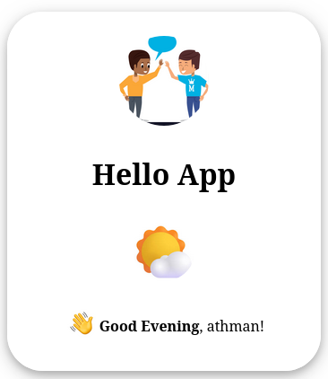
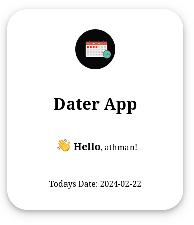

# :lock: SSO
> :bulb: single sign-on 
## 💬 Description
> This is a project that shows the concept of single-sign on with keycloak and django. Single sign on allows multiple projects to share authentication and authorization session providing better user experience and secure web applications.
> The idea in this project is to allow a user to sign in on one application and not need to sign in again on another application because they already logged in, so authorization is done once.

## 📜 More

> ## Keycloak
> This is a open source access manager that has features such as sso.
> For this project we run the application on a docker container.
> 
> ## Application 1 (hello)
> A simple django application running in a docker container that shows a hello message to a logged in user. 
> 
> 
>## Application 2 (dater)
> A simple django application running in a docker container that shows a logged in user the current day's date.  
> 

>## Docker
> Allows creating of images and running containers providing an environment to showcase the idea we are talking about. 

## 🔧 Code Setup
   1. Clone the repo
        ```bash
            git clone https://github.com/django-sso.git

        ```
   1. Move into the project file
        ```bash
            cd django-sso

        ```
## 💻🏃‍♂️ Running Code Snippet
   1. Move into docker dir
        ```bash
            cd docker

        ```
   1. Run docker services
        ```bash
            docker-compose -f ssorun.yaml up

        ```


